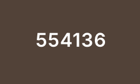
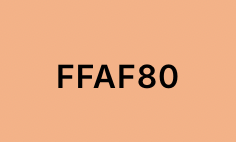
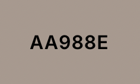
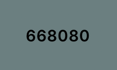
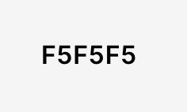

# README

## Kathryn Sonner

### [](https://app.netlify.com/sites/about-me-ksonner/deploys)
### Description
The prupose of this project is to demonstrate the skills leanred through the semester about HTML and CSS

In the head section of the html code I learned how to add fonts and connect my css files 
```html
    <link rel="preconnect" href="https://fonts.googleapis.com">
    <link rel="preconnect" href="https://fonts.gstatic.com" crossorigin>
    <link href="https://fonts.googleapis.com/css2?family=Montserrat&family=Sigmar&display=swap" rel="stylesheet">

    <link href="css/style.css" rel="stylesheet">
    <link href="css/nav.css" rel="stylesheet">
```

In the body section I leanred how to add an image and a nav bar 

```html
<div class="logo">
    
        <h1>Web Dev I </h1> 
        </div>
        <div class="navbar-links">
            <ul>
                <li><a href="#bio">Bio</a></li>
                <li><a href="#gallery">Gallery</a></li>
                <li><a href="#lit">Blog</a></li>
                <li><a href="#contact">Contact Me</a></li>
            </ul>
        </div>
```
When it came to the nav bar, I had to chnage the original navbar I had to be a hamburger when in the mobile state and then the original vegitarian navbar in larger states. In order to do this I had to add the html and css for both navbars then I had to go into the css file specifically for my navbars and within the media querys specify ```display:none;``` for each nav bar. 

```ruby
@media screen and (min-width: 60rem){

.navigation-mobile{
    display: none;
}
    
.navbar-large{
    display: flex;
}
}
```
---
---
---
### Blog Topic
The topic I chose for my blog was about CSS animations. I chose this topic because I there is so much to learn. When doing my resaerch I leanred about the basic techniques involved, but as I dig deeper I found incredible examples of what's possible using html and css. I added some basic examples and some more complex examples to show just a few of the possibilites. It took me some time to figure out how to incorperate these examples into my code while making sure it looked appealing and I have learned so much from this process. 

I used 3 sources for this blog post:
https://www.w3schools.com/css/css3_animations.asp
https://developer.mozilla.org/en-US/docs/Web/CSS/CSS_animations/Using_CSS_animations
https://prismic.io/blog/css-animation-examples

---
---
### Color Scheme
I mainly used 6 colors 
* `rgb(143, 191, 191)` 
* `rgb(85, 65, 54)`
* `rgb(255, 175, 128)`
* `rgb(170, 152, 142)`
*  `rgb(102, 128, 128)`
* `rgb(245, 245, 245)`

### Citations 
(https://codepen.io/erikterwan/pen/EVzeRP) 

### License 
For my webite I would copyright it, this is my work and no one should be able to take it. Especailly my logo. 